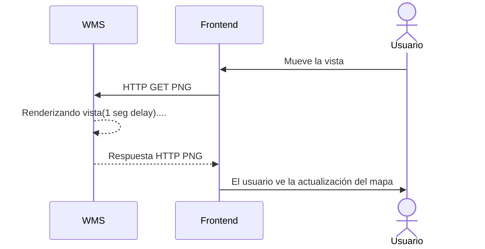
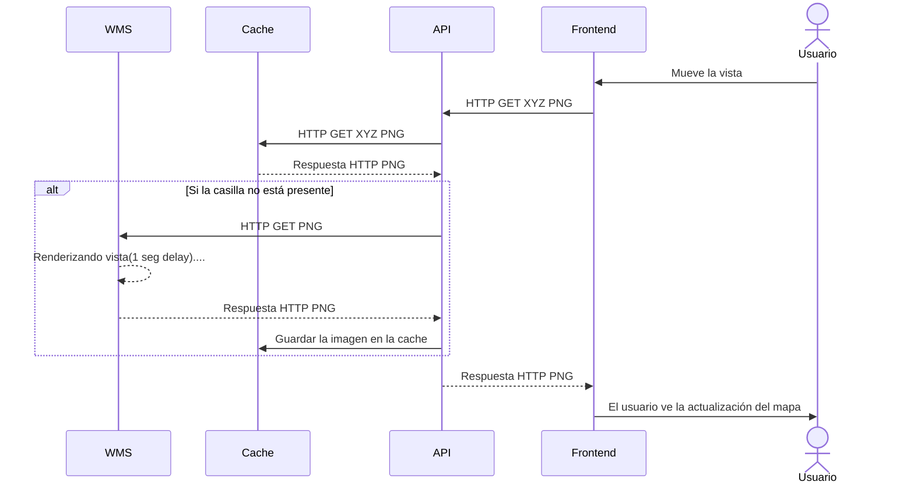

Como todo buen chaval en sus 20, me gusta vivir la vida y tener mis caprichines: 
conseguir un buen curro, independizarme, ahorrar para mi jubilación y comprar una vivienda.
Afortunadamente, la mayoría de estos objetivos van bien encaminados pero lo de comprar
la vivienda se me resiste. A veces me frustro con ello porque creo no hacer lo suficiente
para lograrlo pero después veo los tipos de interés y se me pasa.

En todas mis venturas y desventuras en la búsqueda de un inmueble que me pueda permitir
hay una constante: el mar de lágrimas que supone buscar información catastral. Una tarde
de búsqueda de inmuebles suele ser así:

1. Hacer *doomscrolling* a través de una miríada de anuncios que no se adecuan a mis necesidades<text class="joke">(a.k.a tendría que vender mi alma al diablo)</text> 
2. Encontrar un inmueble que podría valerme
3. Revisar la información contra el catastro, especialmente para los terrenos<text class="joke">(Sí, valoro la autopromoción. ¿Que estoy loco? Lo sé)</text>. 
Normalmente no hay referencia catastral y hay que ~~sufrir~~ utilizar el mapa de la web
4. Volver al punto 1

Pero Juan, ¿Por qué buscas todo esto en el catastro si normalmente en el anuncio te suele venir detallado? Una vez reporté un anuncio por listar un 
terreno como urbano cuando en la información catastral del terreno(proporcionada en el anuncio) se listaba como rústico. 
Procedieron a quitar la información catastral del anuncio en vez de listarla correctamente. Uno no se puede fiar de nadie hoy en día,
y menos con algo que te puede hipotecar<text class="joke">(pun intended)</text> de por vida.

#### Experiencia de usuario


Os presento el mapa del catastro <text class="joke">(Por favor, dioses del HTML, no rompáis esto en el futuro :pray:)</text>:

<embed src="https://www1.sedecatastro.gob.es/cartografia/mapa.aspx" style="width:100%; height: 600px;">

A primera vista, puede parecer que el mapa es *responsive*. Invito al lector a hacer zoom hasta que se empiece a ver la información catastral:


A poco que se mueva el mapa se puede ver un símbolo de carga. Este se repite si se quiere cambiar la vista lo cuál, sinceramente, resulta bastante molesto. 
Si lo comparamos con la experiencia de usuario de Google Maps deja bastante que desear :cry::

<iframe src="https://www.google.com/maps/embed?pb=!1m14!1m12!1m3!1d10320.778665109237!2d-3.8255837034881357!3d43.45703729569251!2m3!1f0!2f0!3f0!3m2!1i1024!2i768!4f13.1!5e0!3m2!1sen!2ses!4v1708292145491!5m2!1sen!2ses" width="100%" height="600" style="border:0;" allowfullscreen="" loading="lazy" referrerpolicy="no-referrer-when-downgrade"></iframe>


#### ¿Cómo funciona el catastro?

Por defecto profesional, ver que un sistema informático no funciona debidamente me llama la atención y, si lo tengo que usar frecuentemente, necesito intentar 
arreglarlo <text class="joke">(aunque parezca lo contrario por mi historial de Github :sweat_smile:)</text>.
Al ser un servicio externo, es bastante complicado arreglarlo pero a veces se puede intentar paliar. Por intentarlo no pasa nada ¿no?

##### Peticiones HTTP

Como *backender*, mi primer instinto es ir a lo que conozco, las peticiones a una API:

<embed src="http://www.softwareishard.com/har/viewer/?inputUrl=https://juantoca.github.io/assets/posts/catastro/catastro-peticiones.har" style="width:100%; height: 450px;">


Como se puede observar, se utilizan varias peticiones para renderizar el mapa:
1. Las imágenes tomadas de [tms-ign-base.idee.es](http://idee.es) que son bastante eficientes :+1:
2. Las imágenes tomadas de [sedecatastro.gob.es](https://www.sedecatastro.gob.es) que no lo son :-1:

El hecho que una imagen del mapa tenga una latencia de casi 1 segundo no es un buen augurio. Echemosle un vistazo a varios de los parametros de la request:

```
SERVICE=WMS
WIDTH=1920
HEIGHT=425
BBOX=-434969.6867710633,5381250.394276095,-425797.2433768422,5383280.75283992
```

Hay varias cosas a destacar en estos parámetros:
- Los parámetros WIDTH y HEIGHT muestran claramente una petición de una imagen del tamaño del navegador.
Esto se contrasta con la manera de hacer queries de Google Maps o [tms-ign-base.idee.es](http://idee.es) ya que estos reciben varias imágenes por renderizado.
- BBOX al ser un rango continuo en vez de discreto, apunta a que el servidor realiza el renderizado a la hora de hacer la petición. La manera en la que se hace el resto de peticiones, al ser discretas y seguir una estructura de directorios, apunta a un servidor de contenido que simplemente sirve los archivos almacenados.
-  El parámetro SERVICE apunta a una especificación de protocolo o de servidor de *backend*. Volveremos a ello más tarde.

La principal conclusión que se podría sacar de este análisis es que la interfaz de la request no es muy _cache friendly_. Cada vez que se mueve la visión del mapa es necesario 
rerenderizar la imagen entera. Además, no se puede prerenderizar imagenes fuera del _viewport_ como en los mapas basados en _tiling_. Estos factores hacen la experiencia de usuario
muy ortopédica.

##### ¿Podemos arreglarlo del lado del cliente?

La hipótesis del apartado anterior apunta a que las peticiones no están muy optimizadas. Podría parecer a primera vista que no podemos hacer nada al respecto pero... ¡resulta que 
sí!.

Os presento [Leaflet.js](https://leafletjs.com/), una librería para integrar mapas interactivos usando diferentes servidores. Mientras leía la documentación de la librería para integrar la vista de [idee.es](http://idee.es), descubrí que había algo que se llamaba [TileLayer.WMS](https://leafletjs.com/reference.html#tilelayer-wms) ¿Os suena de algo? Exacto. Es el parámetro SERVICE de la request. Esto apunta a qué el *backend* usa un estándar definido y probablemente algún software _open-source_ para servir la información.

Intentemos crear un pequeño componente JS para renderizar la información del catastro:

```javascript
var map = L.map('map').setView([43.454, -3.823], 18);
var IGN = L.tileLayer('https://tms-ign-base.idee.es/1.0.0/IGNBaseTodo/{z}/{x}/{-y}.jpeg', {maxZoom: 17});
IGN.addTo(map);
var ortofoto = L.tileLayer('https://tms-pnoa-ma.idee.es/1.0.0/pnoa-ma/{z}/{x}/{-y}.jpeg');
ortofoto.addTo(map);
var catastro = L.tileLayer.wms("https://www1.sedecatastro.gob.es/cartografia/GeneraMapa.aspx", {
    layers: 'CATASTRO',
    format: 'image/png',
    transparent: true
});
var baseMaps = {
    "IGN": IGN,
    "Ortofoto": ortofoto
};
var overlayMaps = {
    "Catastro": catastro
}
var layerControl = L.control.layers(baseMaps, overlayMaps).addTo(map);
```

Aquí os presento el prototipo de mapa que permite renderizar tanto el mapa satelital como la información catastral.
Arriba a la derecha se pueden desactivar/activar las diferentes capas. Si se prueba a hacer zoom y se activa la capa
del catastro, se puede ver una gran mejora en el rendimiento. 

> :warning: 
> El servidor del catastro tiene _rate limits_ al número de peticiones. Como el cliente usa un proceso de tiling, hace muchas más requests que de 
> costumbre y puede saltar el _rate limit_. No recomiendo usar esta solución durante mucho tiempo(está aquí con fines ilustrativos) 
> y para nada lo digo por experiencia propia :innocent: 

<embed src="/assets/posts/catastro/componente/index.html" style="width:100%; height: 800px;"> 

#### La raíz del problema

Bingo. Así que se puede crear un cliente muy sencillo que funcione fluido con el *backend*. Entonces... ¿Cómo es que la experiencia de la web es tan nefasta?.

El código JavaScript del renderizado del mapa del catastro se puede acceder a través de [este enlace](https://www1.sedecatastro.gob.es/Cartografia/js/mapa.js). 
Una de las cosas importantes a las que hace referencia es a una librería llamada [OpenLayers](https://openlayers.org/). Esta librería es, en esencia, una alternativa a LeafLet para visualizar mapas.

Veamos como hace uso de esta librería:

```javascript
771 var vectorLayer = new ol.layer.Vector({ title: 'Posicionar', source: vectorSource });

777 var map = new ol.Map({
778    interactions: interaccionesxDefecto,
779    controls: ([pantallaCompleta, rotor, EscalaLineal, PosicionRatonGPS]),
780    target: 'map',
782    layers: [vectorLayer],
783    moveTolerance: 5,
784    view: vistaMapa
785 });
```

Como se puede ver, actualmente el catastro hace un uso ineficiente de la librería al usar una layer de vectorizado. 
Como habíamos visto antes, solicita la información catastral con una única solicitud de todo lo que se necesita renderizar en ese momento.

Si sustituimos la definición del mapa por:
```javascript
779 var map = new ol.Map({
780    interactions: interaccionesxDefecto,
781    controls: ([pantallaCompleta, rotor, EscalaLineal, PosicionRatonGPS]),
782    target: 'map',
783    layers: [layerIGNT, layerTeseladaTamanio, layerTeselada],
784    moveTolerance: 5,
785    view: vistaMapa
786 });
```
y se activa la capa en el loop del programa:

```diff
    if (ponerCAT && ponerCATEscala) {
-        map.addLayer(layer1Imagen);
+        map.addLayer(layerTeselada);
    }
    if (ponerGeoServerWMSR) {
        map.addLayer(layerGeoserverWMSR);
    };
    if (ponerGeoServerWMTSR) {
        map.addLayer(layerGeoserverWMTSR);
    };
    if (soloTematicos) {
        if (ponerTematicos) {
-            map.removeLayer(layer1Imagen);
+            map.removeLayer(layerTeselada);
            map.addLayer(layer1Tematicos);
        };
    }
```
Conseguimos que el cliente obtenga el mapa de manera teselada :tada::tada::tada:

<text class="joke">¿Esperabais una versión modificada de la web del catastro incrustada para demostrarlo? Yo también. Lamentablemente el contador de días sin que CORS de problemas ha vuelto a cero</text>


#### ¿Pero con teselación no bombardearíamos a peticiones el servidor?

Si y no. Efectivamente, con la infraestructura actual del servidor al necesitar renderizar cada imagen que devuelve la teselación 
podría provocar una denegación de servicios <text class="joke">(aunque se podría discutir si es beneficioso el hecho de que sea inherente paralelizable y comprimir imagenes más pequeñas, sobretodo siendo PNG)</text>. De hecho es bastante probable que el javascript tenga capada la teselación por temas de sobrecarga y límite de peticiones.

<style>
.mermaid{
    display: block;
    margin-left: auto;
    margin-right: auto;
}
</style>

<center>Implementación actual</center>



Sin embargo, si la teselación usara un protocolo [XYZ](https://openlayers.org/en/latest/examples/xyz.html) como hace Google o IDEE, sería facilmente convertible en un problema de _content delivery_, lo cuál es inherentemente menos costoso:


<center>Propuesta implementación</center>



Con esta solución, la web del catastro podría tener la fluidez que hemos conseguido en el ejemplo de Javascript sin incurrir en un sobrecoste computacional al lanzar varias renderizaciones simultáneas. Además, no sería necesario un cambio en el backend ni de la infraestructura con la que se suben actualizan los datos.

De hecho, con simplemente invalidar la cache cuando se produzca una actualización de los datos de esa región sería suficiente para tener los datos actualizados.


#### Próximos pasos

Tras este análisis y sin involucrar al catastro, se podría intentar montar un servidor de visualización optimizado con los datos abiertos del catastro. Sin embargo, el [volcado masivo](https://www.catastro.hacienda.gob.es/webinspire/index.html) de los datos del catastro se actualiza 2 veces al año y, sin obtener actualizaciones en tiempo real, el mapa quedaría desactualizado 
rápidamente.

Otra opción sería montar la cache encima de la API pública del servidor WMS. Sería la opción más viable ya que permitiría obtener actualizaciones en tiempo real simplemente 
invalidando la caché. Sin embargo, la API pública del catastro tiene *rate_limits*<text class="joke">(por razones obvias y justificadas)</text> los cuáles bloquearían al servidor
por mínimo tráfico que tuviera.

Así que, de momento, este mini proyecto se va al cajón de proyectos en pausa a la espera de que algún alma caritativa use este post para arreglar la *UX* de la web.

